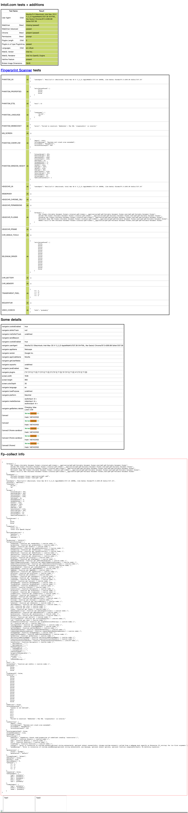

# 劫

一款功能强大的安全评估工具

由于扫描器只是粗暴的调用 xray、nuclei ，不优雅，而且 xray 不开源。于是产生一个想法，将漏扫类项目拆分出来，重新糅合成一个轮子。目前打算设计成两种模式，一种被动、一种主动。

# 语言环境识别

防止对 php 的网站调用 java 的扫描插件

# 插件调用

插件如何调用？

仿照awvs设计了插件类别

PerFile 对每个文件处理,包括文件后面的参数
PerFolder 对每个目录处理
PerScheme 对每个域名处理
PostScan 对Post请求的处理

# 参考

## 爬虫

https://github.com/projectdiscovery/katana

添加了无头浏览器检测绕过 https://bot.sannysoft.com/ 全绿通过

## 被动扫描代理

https://github.com/lqqyt2423/go-mitmproxy

## Xss

https://github.com/hahwul/dalfox

https://github.com/ac0d3r/xssfinder

https://github.com/kleiton0x00/ppmap

## poc
https://github.com/projectdiscovery/nuclei

https://github.com/WAY29/pocV

## 漏扫
https://github.com/wrenchonline/glint

https://github.com/veo/vscan

## 一些其他漏洞

### Fastjson

https://github.com/a1phaboy/FastjsonScan