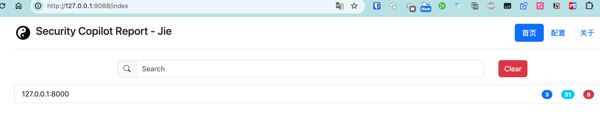
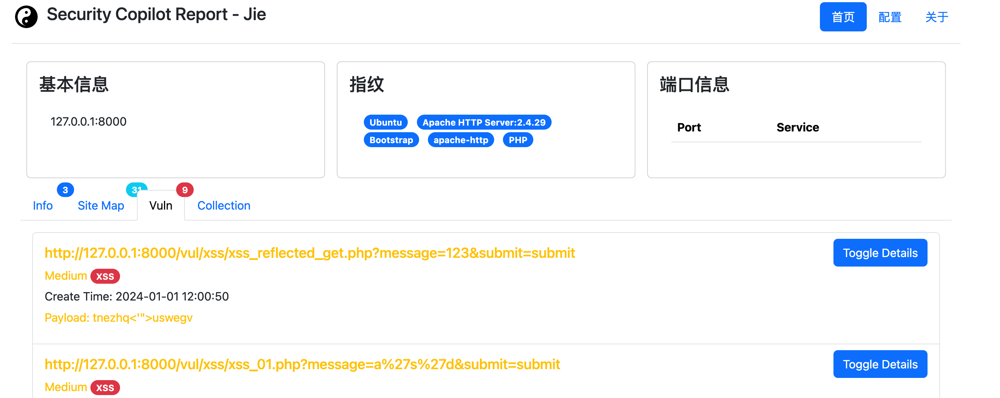
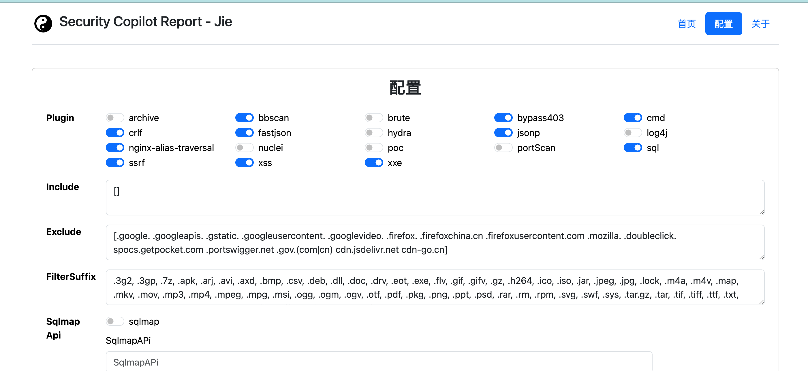
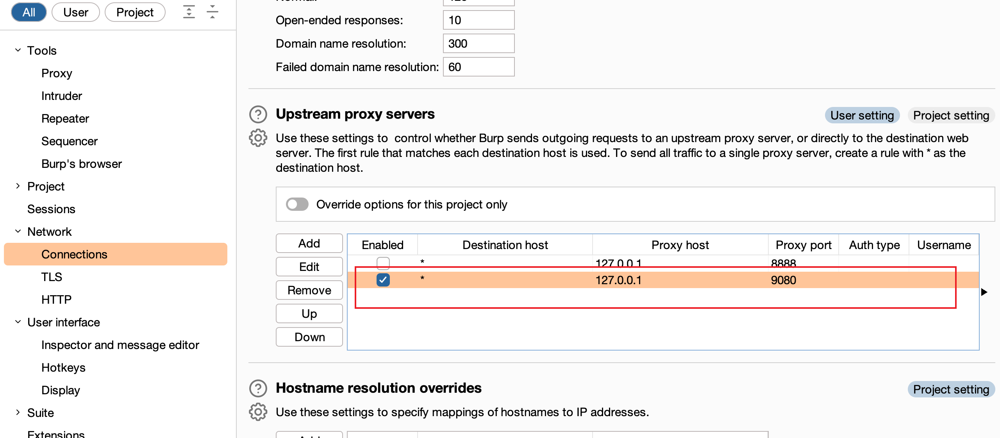

## 劫

>   吾所成之事，不可逆也

<p align="center">
  <a href="https://github.com/yhy0/Jie/blob/main/LICENSE">
    
  </a>
  <a href="https://github.com/yhy0/Jie">
    
  </a>
  <a href="https://github.com/yhy0/Jie">
    
  </a>
  <a href="https://github.com/yhy0/Jie">
    
  </a>
  <a href="https://github.com/yhy0/Jie">
    
  </a>
</p>


<p align="center">
  <a href="https://github.com/yhy0/Jie/blob/main/README.md">English</a> •
  <a href="https://github.com/yhy0/Jie/blob/main/README_CN.md">中文</a> •
</p>

通过[主动爬虫模式](https://github.com/Qianlitp/crawlergo)或[被动代理](https://github.com/lqqyt2423/go-mitmproxy)获取流量，对流量进行分析、扫描。

**使用前请详细阅读文档** 

## 主动模式

内置三种爬虫模式

|                             模式                             | 对应的参数  |
| :----------------------------------------------------------: | ----------- |
| [crawlergo](https://github.com/Qianlitp/crawlergo) 爬虫（浏览器无头模式爬虫） | `--craw c`  |
| **默认**[katana](https://github.com/projectdiscovery/katana) 爬虫 （标准爬行模式使用标准 go http 库处理 HTTP 请求/响应。） | `--craw k`  |
| [katana](https://github.com/projectdiscovery/katana) 爬虫 （浏览器无头模式爬虫） | `--craw kh` |

当使用无头模式时，可以指定 `--show` 来显示浏览器的爬行过程

主动模式下可以通过指定 `--copilot` 来进入 **Security Copilot** 模式，扫描完不退出，方便查看 web 结果页面

```bash
./Jie web -t https://public-firing-range.appspot.com/ -p xss -o vulnerability_report.html --copilot
```

不指定 web 的用户名密码，会自动生成一个`yhy/密码`，可以在日志中查看,比如下面就是自动生成的

`INFO [cmd:webscan.go(glob):55] Security Copilot web report authorized:yhy/3TxSZw8t8w`

## 被动模式(Security Copilot)

被动代理 通过 [go-mitmproxy](https://github.com/lqqyt2423/go-mitmproxy/) 实现。

### Security Copilot

为什么称之为 `Security Copilot`,按照我的构想，这不仅仅是一个漏洞扫描器，还是一个集大成的辅助工具。

挂上扫描器后，过一遍网站，即使没有漏洞，也要告诉我这个网站的大致信息(指纹、cdn、端口信息、敏感信息、API 路径、子域名等等)，这样帮助人工进行进一步的梳理，辅助挖洞，而不是扫描完毕没洞就是完事了，还要人工重新过一遍。

### 证书下载

被动代理下HTTPS 网站需要安装证书，HTTPS 证书相关逻辑与 [mitmproxy](https://mitmproxy.org/) 兼容，

证书会在首次启动命令后自动生成，路径为 ~/.mitmproxy/mitmproxy-ca-cert.pem。

安装信任根证书, 安装步骤可参考 Python mitmproxy 文档：[About Certificates](https://docs.mitmproxy.org/stable/concepts-certificates/)。

### 启动

```bash
 ./Jie  web --listen :9081 --web 9088 --user yhy --pwd 123 --debug
```

这样会监听 9081 端口，web 界面(SecurityCopilot)开放会在 9088 端口

浏览器指定代理 9081，或者联动 burp







## 基本使用

### 配置

一些配置可以通过 [Jie_config.yaml](./Jie_config.yaml)修改，也可以通过`http://127.0.0.1:9088/`的配置界面修改（web 界面修改后会实时更新到配置文件中）

`./Jie web -h`

```bash
Flags:
      --copilot          Blocking program, go to the default port 9088 to view detailed scan information.
                         主动模式下，可以通过指定该参数阻塞程序，扫描完不退出程序，可以到 web 端口查看信息。
  -h, --help             help for web
      --listen string    use proxy resource collector, value is proxy addr, (example: 127.0.0.1:9080).
                         被动模式监听的代理地址，默认 127.0.0.1:9080
      --np               not run plugin.
                         禁用所有的插件
  -p, --plugin strings   Vulnerable Plugin, (example: --plugin xss,csrf,sql,dir ...)
                         指定开启的插件，当指定 all 时开启全部插件
      --poc strings      specify the nuclei poc to run, separated by ','(example: test.yml,./test/*).
                         自定义的nuclei 漏洞模板地址
      --pwd string       Security Copilot web report authorized pwd.
                         web页面登录密码，不指定会随机生成一个密码
      --show             specifies whether the show the browser in headless mode.
                         主动扫描下是否显示浏览器
      --user string      Security Copilot web report authorized user, (example: yhy).]
                         web页面登录用户名，默认为yhy (default "yhy")
      --web string       Security Copilot web report port, (example: 9088)].
                         web页面端口，默认9088 (default "9088")

Global Flags:
      --debug           debug
  -f, --file string     target file
                        主动扫描目标列表，每行一个
  -o, --out string      output report file(eg:vulnerability_report.html)
                        漏洞结果报告保存地址
      --proxy string    proxy, (example: --proxy http://127.0.0.1:8080)
                        指定 http/https 代理
  -t, --target string   target
                        主动扫描目标，被动下不需要指定
```

### 下载编译

https://github.com/yhy0/Jie/releases/latest 中下载对应系统的程序，全程都是由 **Github Action** 自动化构建，请放心使用

#### Linux/Mac

执行`make`即可编译

#### Windows

```bash
export CGO_ENABLED=1;go build -ldflags "-s -w" -o Jie main.go
```

### 与 Burp 联动

#### passive-scan-client 插件（强烈建议）

https://github.com/yhy0/passive-scan-client


通过三个监控开关来自由选择哪些过扫描器。**注：js、css 也应该走扫描器来收集信息**

#### Burp 设置上游代理（不推荐）



这里的上游代理 Intruder 和 Repeater 模块的流量也会走扫描器

这样会造成自己手动测试的数据流量也会全部走扫描器，这样就不好了，这一块应该是按需的。


## 功能

通过主动或者被动收集过来的流量插件内部会判断是否扫描过 （TODO 扫描插件是否要按某个顺序执行？）

### 信息收集

- 网站指纹信息
- 每个网站请求的 url 收集聚合展示
- 网站域名信息: cdn/waf/cloud、解析记录
- Jwt 自动爆破 (todo 根据域名自动生成字典)
- 敏感信息 
- 主动的路径扫描（bbscan 规则 ,新增了一个指纹字段，存在指纹时只会扫描对应的规则，比如 对 php 网站就不会扫描 springboot 的规则）
- 端口信息
- 收集域名、ip、api

### 插件

有的扫描会对比收集的指纹信息进行语言环境识别，防止对 php 的网站调用 java 的扫描插件

#### 扫描目录结构

`scan`目录为扫描插件库，每个目录的插件会处理不同情形

-   PerFile 针对每个url，包括参数啥的
-   PerFolder 针对url的目录，会分隔目录分别访问
-   PerServer 对每个domain 的，也就是说一个目标只扫描一次

|         插件          |                             介绍                             | 默认是否开启 |                         作用域                         |
| :-------------------: | :----------------------------------------------------------: | :----------: | :----------------------------------------------------: |
|          xss          |           语义分析、原型链污染、dom 污染点传播分析           |     true     |                        PerFile                         |
|          sql          |               目前只实现一些简单的SQL注入检测                |     true     |                        PerFile                         |
|        sqlmap         |     通过指定 sqlmap API 将流量转发到 sqlmap 进行注入检测     |    false     |                        PerFile                         |
|         ssrf          |                                                              |     true     |                        PerFile                         |
|         jsonp         |                                                              |     true     |                        PerFile                         |
|          cmd          |                           命令执行                           |     true     |                        PerFile                         |
|          xxe          |                                                              |     true     |                        PerFile                         |
|       fastjson        | 当检测到请求为 json 时，缝合了[@a1phaboy](https://socialify.git.ci/a1phaboy/)师傅的[FastjsonScan](https://socialify.git.ci/a1phaboy/FastjsonScan)扫描器，探测 fastjson; jackson 暂未实现 |     true     |                        PerFile                         |
|       bypass403       | [dontgo403](https://github.com/devploit/dontgo403)  403 绕过检测 |     true     |                        PerFile                         |
|         crlf          |                           crlf注入                           |     true     |                       PerFolder                        |
|          iis          |      iis高版本短文件名猜解[iis7.5-10.x-ShortNameFuzz](       |    false     |                       PerFolder                        |
| nginx-alias-traversal | Nginx 配置错误导致的目录遍历[nginx](https://github.com/vulhub/vulhub/blob/6a142caa19620bffa4cda9989697afd5b4136c87/nginx/insecure-configuration/README.md) |     true     |                       PerFolder                        |
|         log4j         |              log4j 漏洞检测,目前只会测试请求头               |     true     |                       PerFolder                        |
|        bbscan         |  [bbscan](https://github.com/lijiejie/bbscan) 规则 目录扫描  |     true     | PerFolder<br />PerServer(这个针对规则中指定了根目录的) |
|       portScan        | 使用 [naabu](https://github.com/projectdiscovery/naabu) 扫描 Top 1000 端口，然后使用 [fingerprintx](https://github.com/praetorian-inc/fingerprintx) 识别服务 |    false     |                       PerServer                        |
|         brute         |      如果开启服务爆破，会在扫描到端口服务后进行服务爆破      |              |                       PerServer                        |
|        nuclei         |   集成[nuclei](https://github.com/projectdiscovery/nuclei)   |    false     |                       PerServer                        |
|        archive        | 利用 https://web.archive.org/ 进行获取历史 url 链接(参数)，然后进行扫描 |     true     |                       PerServer                        |
|          poc          | go 写的 poc 模块检测， poc 模块依托于指纹识别，只有识别到对应的指纹才会扫描，没有插件化了 |    false     |                       PerServer                        |

###  逻辑漏洞 TODO

添加多个用户 cookie 进行越权检测（感觉还是 burp 插件自己写测试比较好，这里应该没有必要写）


## 第三方库

```go
package main

import (
    "github.com/logrusorgru/aurora"
    "github.com/yhy0/Jie/SCopilot"
    "github.com/yhy0/Jie/conf"
    "github.com/yhy0/Jie/crawler"
    "github.com/yhy0/Jie/pkg/output"
    "github.com/yhy0/logging"
    "net/url"
)

/**
  @author: yhy
  @since: 2023/12/28
  @desc: //TODO
**/

func lib() {
    logging.Logger = logging.New(conf.GlobalConfig.Debug, "", "Jie", true)
    conf.Init()
    conf.GlobalConfig.Http.Proxy = ""
    conf.GlobalConfig.WebScan.Craw = "k"
    conf.GlobalConfig.WebScan.Poc = nil
    conf.GlobalConfig.Reverse.Host = "https://dig.pm/"
    conf.GlobalConfig.Passive.WebPort = "9088"
    conf.GlobalConfig.Passive.WebUser = "yhy"
    conf.GlobalConfig.Passive.WebPass = "123456" // 注意修改为强口令

    // 全部插件开启
    for k := range conf.Plugin {
        // if k == "nuclei" || k == "poc" {
        //     continue
        // }
        conf.Plugin[k] = true
    }

    if conf.GlobalConfig.Passive.WebPort != "" {
        go SCopilot.Init()
    }

    // 初始化爬虫
    crawler.NewCrawlergo(false)

    go func() {
        for v := range output.OutChannel {
            // SCopilot 显示
            if conf.GlobalConfig.Passive.WebPort != "" {
                parse, err := url.Parse(v.VulnData.Target)
                if err != nil {
                    logging.Logger.Errorln(err)
                    continue
                }
                msg := output.SCopilotData{
                    Target: v.VulnData.Target,
                }

                if v.Level == "Low" {
                    msg.InfoMsg = []output.PluginMsg{
                        {
                            Url:      v.VulnData.Target,
                            Plugin:   v.Plugin,
                            Result:   []string{v.VulnData.Payload},
                            Request:  v.VulnData.Request,
                            Response: v.VulnData.Response,
                        },
                    }
                } else {
                    msg.VulMessage = append(msg.VulMessage, v)
                }
                output.SCopilot(parse.Host, msg)
                logging.Logger.Infoln(aurora.Red(v.PrintScreen()).String())
            }
            logging.Logger.Infoln(aurora.Red(v.PrintScreen()).String())
        }
    }()
}
```

## 漏洞利用(还在开发中，优先级低)

**目前还在开发，帮助信息我自己都要看代码才能知道，等搞完了在写详细的**。

因大部分漏洞的利用工具使用 java 编写，并且支持的java 版本不同，搞环境太费劲，恶心坏了，所以重新定义了Jie。

Jie: 一款全面而强大的漏洞`扫描`和`利用`工具。

目前版本(1.0.0)支持以下漏洞的利用

```shell
A Powerful security assessment and utilization tools

Usage:
  Jie [command]

Available Commands:
  apollo      apollo scan && exp
  fastjson    fastjson scan && exp
  help        Help about any command
  log4j       log4j scan && exp
  other       other scan && exp bb:BasicBrute、swagger:Swagger、nat:NginxAliasTraversal、dir:dir)
  s2          Struts2 scan && exp
  shiro       Shiro scan && exp
  web         Run a web scan task
  weblogic    WebLogic scan && exp

Flags:
      --debug           debug
  -f, --file string     target file
  -h, --help            help for Jie
  -o, --out string      output report file(eg:vulnerability_report.html)
      --proxy string    proxy, (example: --proxy http://127.0.0.1:8080)
  -t, --target string   target

Use "Jie [command] --help" for more information about a command.
```

比如 Shiro key 漏洞利用

```bash
# 不指定-m 默认为爆破秘钥和利用链
Jie shiro -t http://127.0.0.1

# 利用
Jie Shiro -t http://127.0.0.1 -m exp -k 213123 -g CCK2 -e spring -km CBC --cmd whoami
```

其中借鉴缝合了很多师傅的工具，对应的漏洞扫描和利用中有写，如有遗漏，可以联系我，添加上
后续会缝合支持更多的漏洞利用。

https://jie.fireline.fun/

## 参考

### 爬虫

[crawlergo](https://github.com/Qianlitp/crawlergo)

[katana](https://github.com/projectdiscovery/katana)


### 被动扫描代理

https://github.com/lqqyt2423/go-mitmproxy

### Xss

语义分析、原型链污染、dom 污染点传播分析

https://github.com/w-digital-scanner/w13scan

https://github.com/ac0d3r/xssfinder

https://github.com/kleiton0x00/ppmap

### SQL 注入 

提取 [sqlmap](https://github.com/sqlmapproject/sqlmap) 中关于检测的代码，提取一部分思想就行了

### poc

通过指纹识别进行对应的漏洞检测

todo 不内置 nuclei 的 yml 文件，改为官方在线下载、更新

https://github.com/projectdiscovery/nuclei

xray poc  中有些写的不规范，导致解析有问题，需要修改
比如：
response.status == 200 && response.headers["content-type"] == "text/css" && response.body.bcontains(b"$_GET['css']")


content-type 应为 Content-Type

但又好像是解析有问题

不使用 xray 的 poc，只使用 nuclei 的 yml 文件
一起使用还要整理，防止重复扫描，nuclei-template 的 poc 已经够了

### 漏扫

https://github.com/wrenchonline/glint 

https://github.com/veo/vscan

### 一些其他漏洞

#### 敏感信息

https://github.com/mazen160/secrets-patterns-db
https://github.com/pingc0y/URLFinder

#### Fastjson

https://github.com/a1phaboy/FastjsonScan


### 指纹

https://github.com/w-digital-scanner/w13scan

https://github.com/SleepingBag945/dddd

## License

This code is distributed under the AGPL-3.0 license. See [LICENSE](https://github.com/yhy0/Jie/blob/main/LICENSE) in this directory.

## 鸣谢

感谢各位师傅的开源作品和博客以及 [JetBrains](https://www.jetbrains.com/) 提供的一系列好用的 IDE 对本项目的支持。


## Star History

[](https://star-history.com/#yhy0/Jie&Date)